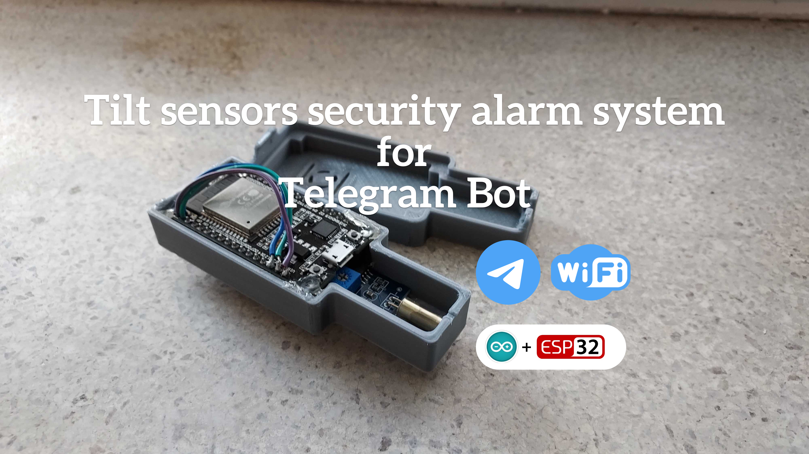

# 🚨 🤖 Security tilt sensor Telegram Bot 
>
This repo is project to tilt sensor surveillance system for example motorcycle. 
My motorcross bike was stoled and I need to secure my primary motorcycle so that 
if anyone tried to steal a motorcycle I would be immediately notified.

## What you need for this project

* ESP32 module
* LM393 Mini Tilt Angle Sensor
* 3D printer 
* Telegram account and bot
* Arduino IDE
* Wifi

